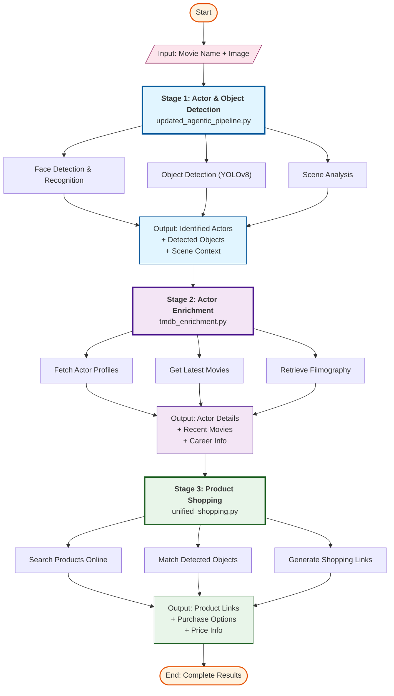
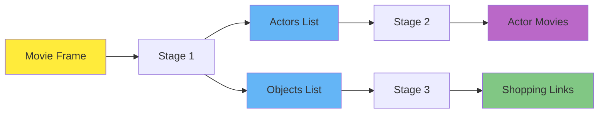

# Pipeline Flow Diagram

## Complete Processing Pipeline



## Pipeline Summary

### Stage 1: Actor & Object Detection
**Script:** `updated_agentic_pipeline.py`
- **Input:** Movie name + Image frame
- **Process:** 
  - Face detection and actor identification
  - Object detection using YOLOv8
  - Scene context analysis
- **Output:** Identified actors, detected objects, scene metadata

### Stage 2: Actor Enrichment
**Script:** `tmdb_enrichment.py`
- **Input:** Identified actors from Stage 1
- **Process:**
  - Fetch actor profiles from TMDB
  - Retrieve latest movies and filmography
  - Gather career information
- **Output:** Enriched actor data with recent movies

### Stage 3: Product Shopping
**Script:** `unified_shopping.py`
- **Input:** Detected objects from Stage 1
- **Process:**
  - Search for products online
  - Match objects to purchasable items
  - Generate shopping links
- **Output:** Product links and purchase options

## Data Flow



## Execution Sequence

```bash
# Step 1: Detect actors and objects
python updated_agentic_pipeline.py --movie "Movie Name" --image "frame.jpg"

# Step 2: Enrich actor information
python tmdb_enrichment.py 

# Step 3: Find shopping links for detected objects
python unified_shopping.py 
```
