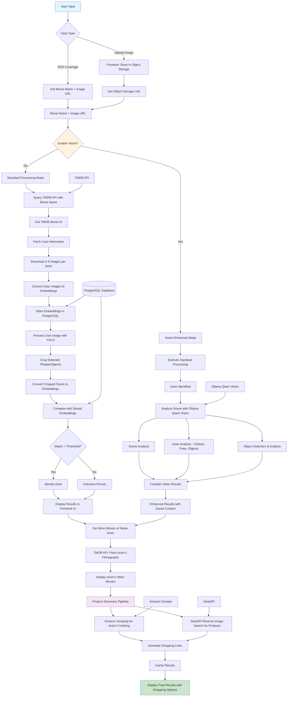

# AI-Powered Movie Analysis & Product Discovery System - Flowchart

## System Architecture Flow

## Key Components Breakdown

### 1. Input Processing
- **Frontend**: Next.js application handles image uploads
- **Object Storage**: Secure image storage with URL generation
- **EPG Integration**: Automatic movie/series detection

### 2. Core Pipeline Modes

#### Standard Mode (Without Vision)
1. **TMDB Integration**: Movie metadata and cast information
2. **Embedding Generation**: Face recognition using embeddings
3. **YOLO Processing**: Object and person detection
4. **Actor Matching**: Threshold-based identification

#### Vision-Enhanced Mode
1. **All Standard Features** +
2. **Scene Analysis**: Context understanding
3. **Actor Analysis**: Clothing, pose, objects held
4. **Object Detection**: Comprehensive scene understanding

### 3. Monetization Features
- **Actor Fashion**: Amazon scraping for clothing items
- **Product Discovery**: Reverse image search for scene objects
- **Shopping Integration**: Direct purchase links

### 4. Technical Stack
- **Frontend**: Next.js (cutting-edge version)
- **Backend**: Python with FastAPI
- **Database**: PostgreSQL (Docker)
- **AI Models**: YOLO, Ollama Qwen Vision
- **APIs**: TMDB, Amazon, SerpAPI